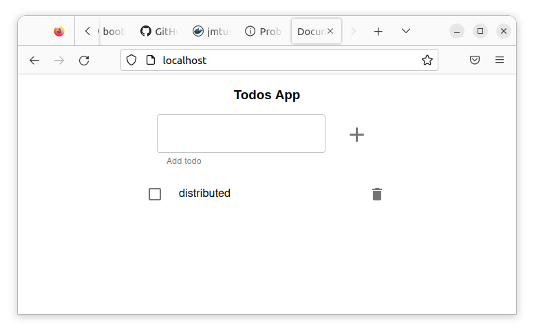

# Construir las imagenes todo-api y todo-front
## todo-api

Entro en el directorio `todo-api` e instalo dependencias
```bash 
npm install
```

Levanto app
``` bash
$ npm start
> todo-app-react@1.0.0 start
> nodemon

[nodemon] 1.19.4
[nodemon] to restart at any time, enter `rs`
[nodemon] watching dir(s): src/**/*
[nodemon] watching extensions: ts
[nodemon] starting `ts-node ./src/app.ts`
execute
Server running on port 3000
 ```

Realizo una llamada a la api

```bash
$ wget http://localhost:3000/
--2022-11-25 17:22:30--  http://localhost:3000/
Resolving localhost (localhost)... 127.0.0.1
Connecting to localhost (localhost)|127.0.0.1|:3000... connected.
HTTP request sent, awaiting response... 404 Not Found
2022-11-25 17:22:30 ERROR 404: Not Found.
 ```

La api conecta y responde con un 404 pq la llamada no es correcta, pero el servicio responde.

- Detengo la api (Ctrl + C)

- Genero la imagen
```bash
docker build -t jmtuset/todo-api:latest .
 ```


Subo la imagen a docker. 
```bash
docker push jmtuset/todo-api:latest
 ```


## todo-front

Entro en el directorio `todo-front` e instalo dependencias 
```bash
npm install
```
Genero la imagen de docker
```bash
docker build -t jmtuset/todo-front:latest --build-arg  API_HOST=http://localhost:3000 .
 ```

## Ejecuto los contenedores en local

Ejecuto en local el contenedor api 
```bash
$ docker run -d -p 3000:3000 -e NODE_ENV=production -e PORT=3000 --name todo-api jmtuset/todo-api:latest
 ```

Ejecuto en local el contenedor de front 
```bash
$ docker run -d -p 80:80 --name todo-front jmtuset/todo-front:latest
 ```

Abro un navegador http://localhost e inserto un TODO




Detengo frontend, y abro otro de nuevo
```bash
docker stop todo-front
docker rm todo-front
docker run -d -p 80:80 --name todo-front jmtuset/todo-front:latest
 ```

Abro nuevamente el navegador y observo que aparecen los mismos datos

Detengo el entorno local
```bash
docker stop todo-front
docker rm todo-front
docker stop todo-api
docker rm todo-api
 ```


Genero la imagen de docker de front sin la variable de entorno
```bash
docker build -t jmtuset/todo-front:latest  .
 ```
Subo la imagen a docker. 
```bash
docker push jmtuset/todo-front:latest
 ```
