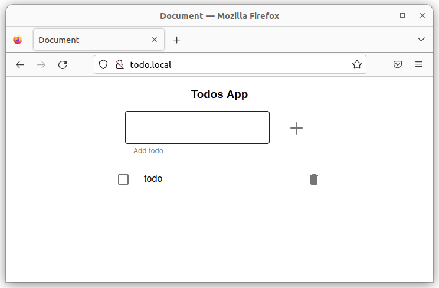
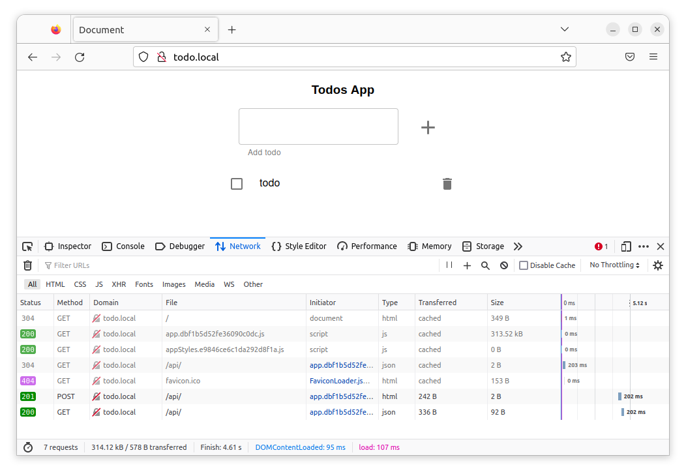

# Ingress
##Preparación

Empiezo generando la imagen de docker y verificando que funciona.
[Pasos para generar la imagen](0-Construir_imagen.md). De esta guia obtengo las imagenes de docker `jmtuset/todo-front:latest` y `jmtuset/todo-api:latest` subida a docker hub.

## Pasos 

Creo un namespace para el ejercicio
``` yaml
apiVersion: v1
kind: Namespace
metadata:
  name: distributed
  labels:
    name: distributed
 ```


### Paso 1. Crear todo-front.
Creo el deployment del todo-front
``` yaml
apiVersion: apps/v1
kind: Deployment
metadata:
  name: todo-front
  namespace: distributed
spec:
  selector:
    matchLabels:
      app: todo-front
  template:
    metadata:
      labels:
        app: todo-front
    spec:
      containers:
      - name: todo-front
        image: jmtuset/todo-front:latest
        resources:
          limits:
            memory: "128Mi"
            cpu: "500m"
        ports:
        - containerPort: 80
 ```

Creo el servicio clusterIp del todo-front
``` yaml
apiVersion: v1
kind: Service
metadata:
  name: todo-front-service
  namespace: distributed
spec:
  selector:
    app: todo-front
  ports:
  - port: 80
    targetPort: 80
 ```

### Paso 2. Crear todo-api.
Creo el configMap para las variables de entorno del API
``` yaml
apiVersion: v1
kind: ConfigMap
metadata:
  name: env-todo-api
  namespace: distributed
data:
  NODE_ENV: production
  PORT: '3000'
 ```

Creo el deployment del todo-api
``` yaml
apiVersion: apps/v1
kind: Deployment
metadata:
  name: todo-api
  namespace: distributed
spec:
  selector:
    matchLabels:
      app: todo-api
  template:
    metadata:
      labels:
        app: todo-api
    spec:
      containers:
      - name: todo-api
        image: jmtuset/todo-api:latest
        resources:
          limits:
            memory: "128Mi"
            cpu: "500m"
        ports:
        - containerPort: 3000
        envFrom:
          - configMapRef:
              name: env-todo-api
 ```

Creo el servicio clusterIp del todo-api
``` yaml
apiVersion: v1
kind: Service
metadata:
  name: todo-api-service
  namespace: distributed
spec:
  selector:
    app: todo-api
  ports:
  - port: 3000
    targetPort: 3000
 ```

### Paso 3. Crear un Ingress para acceder a los servicios del clúster
Instalo Ingres. Añado el addon de ingres
``` bash
minikube addons enable ingress
```
Output
``` bash
💡  ingress is an addon maintained by Kubernetes. For any concerns contact minikube on GitHub.
You can view the list of minikube maintainers at: https://github.com/kubernetes/minikube/blob/master/OWNERS
    ▪ Using image k8s.gcr.io/ingress-nginx/kube-webhook-certgen:v1.1.1
    ▪ Using image k8s.gcr.io/ingress-nginx/kube-webhook-certgen:v1.1.1
    ▪ Using image k8s.gcr.io/ingress-nginx/controller:v1.2.1
🔎  Verifying ingress addon...
🌟  The 'ingress' addon is enabled
 ```

Verifico que existan esten corriendo correctamente los pods del namespace de `ingress-nginx`
``` bash
$kubectl get pods -n ingress-nginx
NAME                                        READY   STATUS      RESTARTS   AGE
ingress-nginx-admission-create-sz6hv        0/1     Completed   0          4m9s
ingress-nginx-admission-patch-qp9f2         0/1     Completed   0          4m9s
ingress-nginx-controller-5959f988fd-mj5st   1/1     Running     0          4m9s
 ```


creo el ingress
``` yaml
apiVersion: networking.k8s.io/v1
kind: Ingress
metadata:
  name: todo-ingress
  namespace: distributed
  labels:
    name: todo-ingress
spec:
  rules:
  - host: todo.local
    http:
      paths:
      - pathType: Prefix
        path: "/api"
        backend:
          service:
            name: todo-api-service 
            port: 
              number: 3000
      - pathType: Prefix
        path: "/"
        backend:
          service:
            name: todo-front-service 
            port: 
              number: 80
 ```

Despliego los yaml
``` bash
k apply -f .
 ```

Cambio el namespace por defecto a `distributed`

``` bash
$kubectl config set-context --current --namespace=distributed
Context "minikube" modified.
 ```

Verifico pods 
``` bash
$ k get po 
NAME                         READY   STATUS    RESTARTS   AGE
todo-api-6456977696-zg994    1/1     Running   0          6s
todo-front-c6ff8675b-x2924   1/1     Running   0          38s
 ```

Verifico servicios 
``` bash
$ k get svc 
NAME                 TYPE        CLUSTER-IP      EXTERNAL-IP   PORT(S)    AGE
todo-api-service     ClusterIP   10.105.155.93   <none>        3000/TCP   19s
todo-front-service   ClusterIP   10.105.99.202   <none>        80/TCP     28s
 ```

Verifico ingress
```bash
$ k get ingress 
NAME           CLASS   HOSTS        ADDRESS        PORTS   AGE
todo-ingress   nginx   todo.local   192.168.49.2   80      94s
 ```

Configuro el hostname `todo.local` a la IP del ingress. Edito el fichero `/etc/hosts` y anado la siguiente linea
``` bash
192.168.49.2       todo.local
 ```

Verifico que funciona correctament con un ping
``` bash
$ ping todo.local
PING todo.local (192.168.49.2) 56(84) bytes of data.
64 bytes from todo.local (192.168.49.2): icmp_seq=1 ttl=64 time=0.120 ms
64 bytes from todo.local (192.168.49.2): icmp_seq=2 ttl=64 time=0.117 ms
64 bytes from todo.local (192.168.49.2): icmp_seq=3 ttl=64 time=0.084 ms
 ```

Abro un navegador http://todo.local


Mediante las Tools del navegador verifico que el front hace las llamadas a la api



