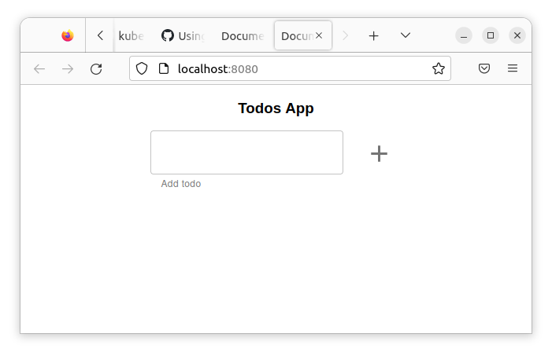
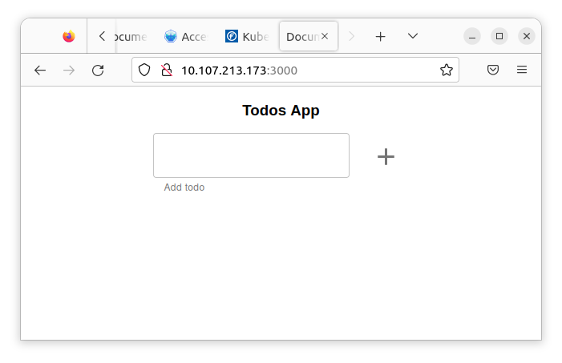

# Monolito en memoria
##Preparación

Empiezo generando la imagene docker y verificando que funciona.
[Pasos para generar la imagen](0-Construir_imagen.md). De esta guia genero la imagen `jmtuset/lc-todo-monolith:latest` de la app en memoria y la subo a docker hub.
## Pasos 
### Paso 1. Crear todo-app

Creo un namespace para el ejercicio.

``` yaml
apiVersion: v1
kind: Namespace
metadata:
name: monolith-in-memory
labels:
    name: monolith-in-memory
```

Para la configuración de variables de entorno creo un configmap

``` yaml
apiVersion: v1
kind: ConfigMap
metadata:
  name: env-todo-app
  namespace: monolith-in-memory
data:
  NODE_ENV: production
  PORT: '3000'
```

Creo el deployment de la app
``` yaml
apiVersion: apps/v1
kind: Deployment
metadata:
name: todo-app
namespace: monolith-in-memory
spec:
selector:
    matchLabels:
    app: todo-app
template:
    metadata:
    labels:
        app: todo-app
    spec:
    containers:
    - name: todo-app
        image: jmtuset/lc-todo-monolith:latest
        resources:
        limits:
            memory: "128Mi"
            cpu: "500m"
        ports:
        - containerPort: 3000
        envFrom:
        - configMapRef:
            name: env-todo-app
```

Aplico los fichero

``` bash
k apply -f .
```
## Verifico los pasos

Configuro el namespace por defecto al del ejecicio
``` bash
$kubectl config set-context --current --namespace=monolith-in-memory
Context "minikube" modified.
```

Miro los pods
``` bash
$ k get po
NAME                        READY   STATUS    RESTARTS   AGE
todo-app-7b548f5f97-nh8kt   1/1     Running   0          85s
```
.
El pod esta corriendo. Mediante un port-forward me conecto al pod para ver que funciona correctamente

``` bash
$ k port-forward todo-app-7b548f5f97-nh8kt 8080:3000
Forwarding from 127.0.0.1:8080 -> 3000
Forwarding from [::1]:8080 -> 3000
```

Abro un navegador a la url http://localhost:8080



## Paso 2. Acceder a todo-app desde fuera del clúster

Creo el servicio de tipo `LoadBalancer`

``` yaml
apiVersion: v1
kind: Service
metadata:
name: todo-app-service
namespace: monolith-in-memory
spec:
selector:
    app: todo-app
ports:
- port: 3000
    targetPort: 3000
type: LoadBalancer
```

Creo el tunnel del servicio
``` bash
minikube tunnel
```

Verifico el servicio.
``` bash
$ k get svc
NAME               TYPE           CLUSTER-IP       EXTERNAL-IP      PORT(S)          AGE
todo-app-service   LoadBalancer   10.107.213.173   10.107.213.173   3000:31347/TCP   16m
```


- Del servicio extraigo la IP del balanceador. Abro un navegador con la url http://10.107.213.173:3000




