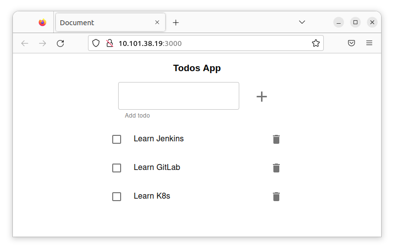

# Monolito
##Preparación

Empiezo generando la imagen de docker y verificando que funciona.
[Pasos para generar la imagen](0-Construir_imagen.md). De esta guia obtengo la imagen de docker `jmtuset/lc-todo-monolith-psql:latest` subida a docker hub.


## Pasos 
### Paso 1. Crear una capa de persistencia de datos

Creo un namespace para el ejercicio.

``` yaml
apiVersion: v1
kind: Namespace
metadata:
  name: monolith
  labels:
    name: monolith
```

Para el almacenamiento empiezo creando la `StorageClass`.
``` yaml
apiVersion: storage.k8s.io/v1
kind: StorageClass
metadata:
  name: sc
  namespace: monolith
provisioner: k8s.io/minikube-hostpath
reclaimPolicy: Delete
volumeBindingMode: Immediate
```

Seguidamente creo el `PersistentVolumne` utilizando la `StorageClass` creada.

``` yaml
apiVersion: v1
kind: PersistentVolume
metadata:
  name: pv0001
  namespace: monolith 
spec:
  storageClassName: sc  
  accessModes:
    - ReadWriteOnce
  capacity:
    storage: 1Gi
  hostPath:
    path: /data/pv0001/
```

Para el `Statefulset`. Primero necesito el servicio del Statefulset. 
``` yaml
apiVersion: v1
kind: Service
metadata:
  name: svc-postgres
spec:
  selector:
    app: postgres-db
  ports:
  - port: 5432
    targetPort: 5432
```

Ahora creo el Statefulset, utilizando:
  - el servicio `svc-postgres` que acabo de crear, 
  - Con un `volumeClaimTemplates` utilizando el `PersistentVolume` creado.
  - Montando un `volume` utilizando el `volumeClaim` definido y mapeando el volumen a al path donde el postgres persiste los datos.

``` yaml
apiVersion: apps/v1
kind: StatefulSet
metadata:
  name: state-postgres
  namespace: monolith
spec:
  serviceName: svc-postgres
  replicas: 1
  selector:
    matchLabels:
      app: postgres-db
  template:
    metadata:
      labels:
        app: postgres-db
    spec:
      containers:
      - name: postgres-db
        image: postgres:10.4
        ports:
        - containerPort: 5432
          name: db
        volumeMounts:
        - name: pv-storage
          mountPath: /var/lib/postgresql/data
  volumeClaimTemplates:
  - metadata:
      name: pv-storage
    spec:
      accessModes: ["ReadWriteOnce"]
      resources:
        requests:
          storage: 1Gi
      storageClassName: sc
```

Aplico los fichero al cluster

``` bash
k apply -f .
```

Configuro el namespace por defecto al del ejecicio
``` bash
$kubectl config set-context --current --namespace=monolith
Context "minikube" modified.
 ```

Verifico los pods
``` bash
$ k get po
NAME               READY   STATUS    RESTARTS   AGE
state-postgres-0   1/1     Running   0          22s
 ```


### Desplegar la base de datos.
Para desplegar la bbdd me conecto al pod del postgres e importo la base de datos. El fichero todos_db.sql esta en el directorio de todo-app del ejercicio
``` bash
$ kubectl exec -i -t state-postgres-0 -- psql -U postgres < todos_db.sql
```


## Paso 2. Crear todo-app

Para la configuración de variables de entorno creo un configmap

``` yaml
apiVersion: v1
kind: ConfigMap
metadata:
  name: env-todo-app
  namespace: monolith
data:
  NODE_ENV: production
  PORT: '3000'
  DB_HOST: svc-postgres
  DB_USER: postgres
  DB_PASSWORD: postgres
  DB_PORT: '5432'
  DB_NAME: todos_db
  DB_VERSION: '10.4'
```

Creo el deployment de la app utilizando el configMap `env-todo-app`

``` yaml
apiVersion: apps/v1
kind: Deployment
metadata:
  name: todo-app
  namespace: monolith
spec:
  selector:
    matchLabels:
      app: todo-app
  template:
    metadata:
      labels:
        app: todo-app
    spec:
      containers:
      - name: todo-app
        image: jmtuset/lc-todo-monolith-psql
        resources:
          limits:
            memory: "128Mi"
            cpu: "500m"
        ports:
        - name: http
          containerPort: 3000
        envFrom:
          - configMapRef:
              name: env-todo-app
 ```

Creo el servicio de tipo `LoadBalancer` 
``` yaml
apiVersion: v1
kind: Service
metadata:
  name: todo-app-service
  namespace: monolith 
spec:
  selector:
    app: todo-app
  ports:
  - port: 3000
    targetPort: 3000
  type: LoadBalancer
 ```


Aplico los fichero al cluster

``` bash
k apply -f .
```


Creo el tunnel del servicio
``` bash
minikube tunnel
```

Verifico el servicio.
``` bash
$ k get svc
NAME               TYPE           CLUSTER-IP     EXTERNAL-IP    PORT(S)          AGE
svc-postgres       ClusterIP      10.101.95.51   <none>         5432/TCP         4m6s
todo-app-service   LoadBalancer   10.101.38.19   10.101.38.19   3000:30929/TCP   4m6s
 ```

Del servicio extraigo la IP del balanceador. Abro un navegador con la url http://10.101.38.19:3000


