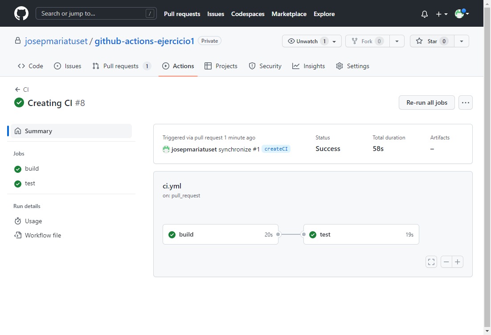

# Ejercicio 1 Github Actions

## CI/CD de una aplicación spring

Copio el proyecto `hangman-front` en el repositorio.
Creo el workflow CI de github actions. Creo en la raiz la carpeta `.github/workflows` y dentro el fichero `ci.yaml`.


Empiezo definiendo el el nombre `CI` y que quiero que se lance cuando se cree una pull_request hacia `main` y existan cambios en el directorio `hangman-front`.

```yaml
name: CI

on: 
  pull_request:
    branches: [ main ]
    paths: ['hangman-front/**']
```

En esta primera version hay que compilar el código. Dentro de jobs defino el primer job que se llamma `build` que es el que compilará el código. 
Para compilar utilizaré una imagen de ubuntu con los steps de `checkout`para que descargue el código del repositorio en el runner.
Como estoy utilizando una imagen limpia, configuro la version de node a la `16` y para que cachee las dependencias del npm le indico el fichero de que utilizará para saber cuando refrescar la cache `cache-dependency-path: hangman-front/package-lock.json`.

Indico el directorio donde tengo el código en `working-directory`.
Con esto ya tengo preparado el job para ejecutar los comandos propios de build.

Primero limpiamos e instalamos las dependencias con `npm ci`. Posteriormente hacemos el compilado con `npm run build` añado el flag `--if-present` para unicamente ejecutar el comando si esta presente.

```yaml
jobs:
  build:
    runs-on: ubuntu-latest
    steps:
      - uses: actions/checkout@v3 
      - uses: actions/setup-node@v3 
        with:
          node-version: 16
          cache: 'npm'
          cache-dependency-path: hangman-front/package-lock.json
      - name: build 
        working-directory: ./hangman-front
        run: |
          npm ci 
          npm run build --if-present
```

Para ejecutar los test unitarios creo otro job llamado `test`que será muy similar al de compilar cambiando los comandos.
Definiendo las `needs` hago que el job dependa del de `build` para que primero haga el de build y luego este.

``` yaml
  test:
    runs-on: ubuntu-latest
    needs: build
    steps:
      - uses: actions/checkout@v3 
      - uses: actions/setup-node@v3 
        with:
          node-version: 16
      - name: test 
        working-directory: ./hangman-front 
        run: | 
          npm ci 
          npm test
```

fichero completo
```` yaml
name: CI

on: 
  pull_request:
    branches: [ main ]
    paths: ['hangman-front/**']

jobs:
  build:
    runs-on: ubuntu-latest
    steps:
      - uses: actions/checkout@v3 
      - uses: actions/setup-node@v3 
        with:
          node-version: 16
          cache: 'npm'
          cache-dependency-path: hangman-front/package-lock.json
      - name: build 
        working-directory: ./hangman-front
        run: |
          npm ci 
          npm run build --if-present
      
  test:
    runs-on: ubuntu-latest
    needs: build
    steps:
      - uses: actions/checkout@v3 
      - uses: actions/setup-node@v3 
        with:
          node-version: 16
      - name: test 
        working-directory: ./hangman-front 
        run: | 
          npm ci 
          npm test
````

En el codigo hay un test falla.
```js
  ● StartGame component specs › should display a list of topics

    expect(received).toHaveLength(expected)

    Expected length: 1
    Received length: 2
    Received array:  [<li>topic A</li>, <li>topic B</li>]

      14 |     const items = await screen.findAllByRole('listitem');
      15 |
    > 16 |     expect(items).toHaveLength(1);
         |                   ^
      17 |     expect(getTopicsStub).toHaveBeenCalled();
      18 |   });
      19 | });

      at _callee$ (src/components/start-game.spec.tsx:16:19)
      at tryCatch (src/components/start-game.spec.tsx:2:1)
      at Generator._invoke (src/components/start-game.spec.tsx:2:1)
      at Generator.next (src/components/start-game.spec.tsx:2:1)
      at asyncGeneratorStep (src/components/start-game.spec.tsx:2:1)
      at _next (src/components/start-game.spec.tsx:2:1)

Test Suites: 1 failed, 1 total
Tests:       1 failed, 1 total
Snapshots:   0 total
Time:        2.112 s
Ran all test suites.
Error: Process completed with exit code 1.
````

Reviso corrijo el test que esta mal.

````js
import React from 'react';
import { render, screen } from '@testing-library/react';
import { StartGameComponent } from './start-game.component';
import * as api from '../services/game.api';

describe('StartGame component specs', () => {
  it('should display a list of topics', async () => {
    const getTopicsStub = jest
      .spyOn(api, 'getTopics')
      .mockResolvedValue(['topic A', 'topic B']);
    
    render(<StartGameComponent />);

    const items = await screen.findAllByRole('listitem');

    expect(items).toHaveLength(2);
    expect(getTopicsStub).toHaveBeenCalled();
  });
});
````

Ahora ya pasa la CI.

