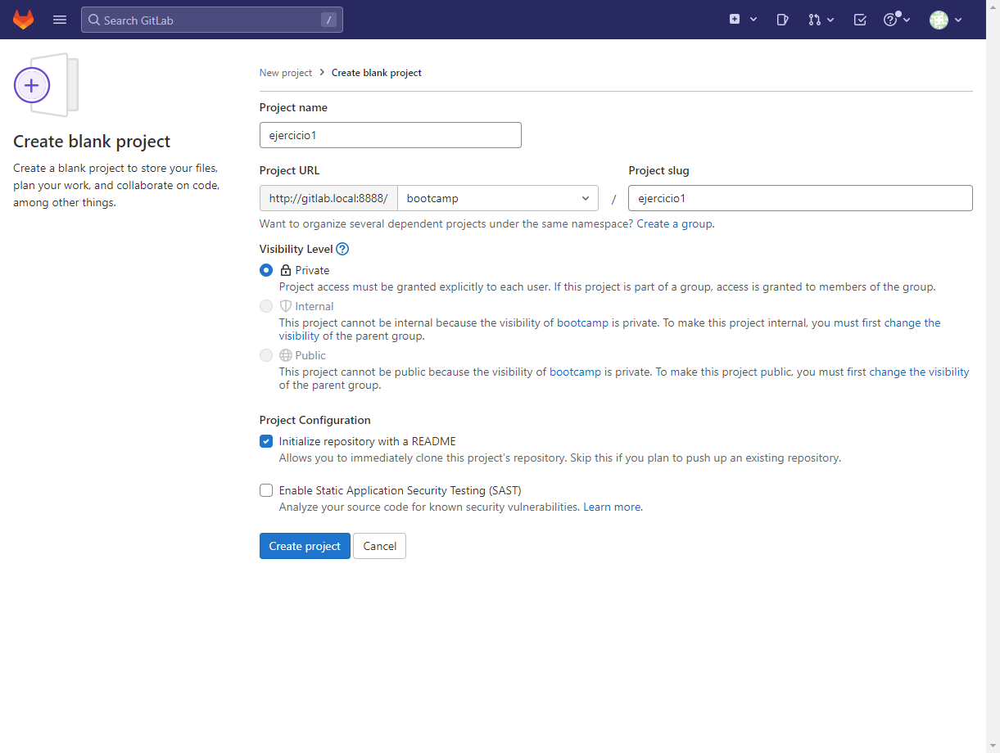

# Ejercicio 1 Gitlab

## CI/CD de una aplicación spring

Accedo al GitLab que tengo en local en mi maquina (<http://gitlab.local:8888/>)

Creo un nuevo proyecto. Hacer click en el boton `New project` e introducir los siguientes datos



Clono el repositorio en mi local.
```` bash
$git clone git@gitlab.local:bootcamp/ejercicio1.git
Cloning into 'ejercicio1'...
remote: Enumerating objects: 3, done.
remote: Counting objects: 100% (3/3), done.
remote: Compressing objects: 100% (2/2), done.
remote: Total 3 (delta 0), reused 0 (delta 0), pack-reused 0
Receiving objects: 100% (3/3), done.
````

Copio los ficheros de la app en el repo.

Creo en el repo el fichero `.gitlab-ci.yml`.

- `image`. Indica la versión del la imagen que se utilizará en los stages a no ser que se indique otra. La pipeline ha de compilar un proyecto java con maven. En el enunciado se indica que se utilice la version maven 3.6.3., y la applicación a compilar es de java, por lo que se utilizara la imagen `maven:3.6.3-jdk-8`

```yaml
image: maven:3.6.3-jdk-8
```

- `stage pre`. Es un stage opcional que utilizo para realizar validaciones previas. En este caso es únicamente informativo de las versiones de maven y java que utilizo.

```yaml
pre-job:
  stage: pre
  script:
    - mvn --version
    - java -version
```

- `stage build`. En este stage se compilará la aplicación con el comando `mvn clean package`. `clean` para eliminar la carpeta de compilación y `package` para generar el paquete. Si todo va bien, guardamos el binario generado `target/spring-boot-hello-world-1.0.0-SNAPSHOT.jar` para los otros stages.

```yaml
build-job:
  stage: build
  script:
    - echo "Compiling the code..."
    - mvn clean package
    - echo "Compile complete."
  artifacts:
    untracked: false
    when: on_success
    expire_in: "30 days"
    paths:
      - "target/spring-boot-hello-world-1.0.0-SNAPSHOT.jar"
```

- `stage test`. En este stage se pasan los test. Se guarda el resultado de la ejecución de los tests para que se pueda consultar posteriormente.

```yaml
unit-test-job:
  stage: test
  script:
    - echo "Running unit tests..."
    - mvn verify
  artifacts:
    when: always
    reports:
      junit:
        - target/surefire-reports/TEST-*.xml
        - target/failsafe-reports/TEST-*.xml
```

- `stage docker`. En este stage se dockeriza la aplicación mediante el Dockerfile del repo. En este stage se utiliza una imagen de docker para generar la imagen. Para dockerizar la aplicación se utiliza el artefacto generado en el stage de build. Al construir la imagen de docker se tagea la imagen con el número de la ejecución de la pipeline para tener la versión de cada ejecución. La imagen se sube al registry de gitlab. Para poder subir es necesario logarse.

```yaml
docker-build-push-job:
  image: docker:latest
  stage: docker
  script:
  - echo "Creating docker image"
  - docker build -t gitlab.local:5001/bootcamp/ejercicio1:$CI_PIPELINE_ID . 
  - docker login -u gitlab-ci-token -p $CI_BUILD_TOKEN gitlab.local:5001
  - docker push gitlab.local:5001/bootcamp/ejercicio1:$CI_PIPELINE_ID
```

- `stage deploy`. En este stage se despliega la imagen generada. Se utiliza una imagen de docker para levantar el contenedor. Mediante una consulta a docker obtengo la IP del contenedor para poder poder hacer una llamada a la aplicación y verificar que esta corriendo. Si todo va bien, se elimina el contenedor y se tagea la imagen como latest y se sube al registry.

```yaml
deploy-job:
  image: docker:latest

  stage: deploy
  script:
  - docker login -u gitlab-ci-token -p $CI_BUILD_TOKEN gitlab.local:5001
  - docker run -d --name ejer1 -p 8080:8080 gitlab.local:5001/bootcamp/ejercicio1:$CI_PIPELINE_ID
  - CONTAINER_IP=$(docker inspect --format '{{ .NetworkSettings.IPAddress }}' ejer1)
  - sleep 20
  - docker run --rm curlimages/curl:7.87.0 -SL -v $CONTAINER_IP:8080
  - docker stop ejer1 
  - docker rm ejer1 
  - docker tag gitlab.local:5001/bootcamp/ejercicio1:$CI_PIPELINE_ID gitlab.local:5001/bootcamp/ejercicio1:latest  
  - docker push gitlab.local:5001/bootcamp/ejercicio1:latest
  - docker rmi -f gitlab.local:5001/bootcamp/ejercicio1:$CI_PIPELINE_ID 

```

## Fichero completo
```yaml
image: maven:3.6.3-jdk-8

stages:
  - pre
  - build
  - test
  - docker
  - deploy

pre-job:
  stage: pre
  script:
    - mvn --version
    - java -version

build-job:
  stage: build
  script:
    - echo "Compiling the code..."
    - mvn clean package
    - echo "Compile complete."
  artifacts:
    untracked: false
    when: on_success
    expire_in: "30 days"
    paths:
      - "target/spring-boot-hello-world-1.0.0-SNAPSHOT.jar"

unit-test-job:
  stage: test
  script:
    - echo "Running unit tests..."
    - mvn verify
  artifacts:
    when: always
    reports:
      junit:
        - target/surefire-reports/TEST-*.xml
        - target/failsafe-reports/TEST-*.xml

docker-build-push-job:
  image: docker:latest
  stage: docker
  script:
  - echo "Creating docker image"
  - docker build -t gitlab.local:5001/bootcamp/ejercicio1:$CI_PIPELINE_ID . 
  - docker login -u gitlab-ci-token -p $CI_BUILD_TOKEN gitlab.local:5001
  - docker push gitlab.local:5001/bootcamp/ejercicio1:$CI_PIPELINE_ID

deploy-job:
  image: docker:latest

  stage: deploy
  script:
  - docker login -u gitlab-ci-token -p $CI_BUILD_TOKEN gitlab.local:5001
  - docker run -d --name ejer1 -p 8080:8080 gitlab.local:5001/bootcamp/ejercicio1:$CI_PIPELINE_ID
  - CONTAINER_IP=$(docker inspect --format '{{ .NetworkSettings.IPAddress }}' ejer1)
  - sleep 20
  - docker run --rm curlimages/curl:7.87.0 -SL -v $CONTAINER_IP:8080
  - docker stop ejer1 
  - docker rm ejer1 
  - docker tag gitlab.local:5001/bootcamp/ejercicio1:$CI_PIPELINE_ID gitlab.local:5001/bootcamp/ejercicio1:latest  
  - docker push gitlab.local:5001/bootcamp/ejercicio1:latest
  - docker rmi -f gitlab.local:5001/bootcamp/ejercicio1:$CI_PIPELINE_ID 

```