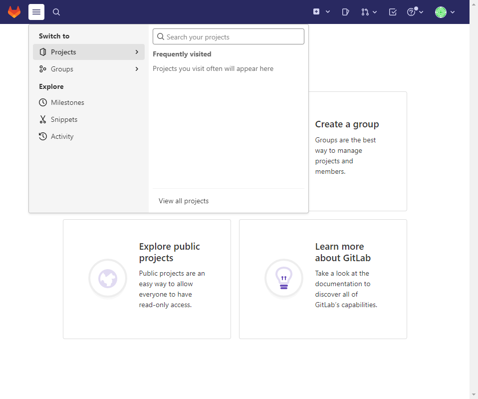

# Ejercicio 2 Gitlab

## Crear un usuario nuevo y probar que no puede acceder al proyecto anteriormente creado

Para crear un nuevo usuario:

- Accedo al gitlab con el usuario `root` y entro en el menu de administración

- Pulso en `New user`

- Relleno los el formulario creando el usuario `developer2`.

- Edito el usuario para setear la password del usuario. Esto se ha de realizar por que el sistema envia un correo, pero en este entorno no envia correos.

password: devP@sswd

Al iniciar la sesión con `developer2` vemos la que está todo vacio y puedo crear un nuevo proyecto, grupo,.. pero no puedo acceder a ningún proyecto ya existente.

## Añadirlo con el role guest, comprobar que acciones puede hacer
Con el usuario `developer1` que es owner de un proyecto me conecto al gitlab. Dentro del proyecto en el menú `Project information` -> `Member` accedo a la pantalla de miembros del proyecto.

Añado al usuario. 

1. Pulsar en `Invite member`
2. Introducir el usuario a invitar `developer2`
3. Seleccionar el role `guest`
4. Pulsar en `Invite`

Al acceder con el usuario `developer2` aparece el proyecto.

- Del proyecto puedo acceder a la wiki del proyecto pero no al repositorio de código, por lo que no puede hacer ni pull, ni push, ni merge request.
- Puede acceder a la `Issues` para ver las que hay, crear de nuevas, hacer el seguimiento.
- `CI/CD` únicamente en modo lectura, puede ver las ejecuciones y su información
- Puede ver las `releases`.
- No puede acceder a los Merge request.
- No puede acceder a la administración del repo

## Cambiar a role reporter, comprobar que acciones puede hacer
Cambio el role del usuario `developer2` a `reporter`

- Puede acceder al repo, no puede editar los ficheros directamente, puede hacer un Fork del Repo, puede ver ramas.
- Puede ver una merge request, puede añadir comentarios pero no puede aprovar una merge request.
- Puede crear, editar, cerrar issues,
- Puede ver las pipelines, sus ejecuciones. No puede encolar una nueva ejecución.
- Puede acceder a package y registry (pull images)

## Cambiar a role developer, comprobar que acciones puede hacer
Cambio el role del usuario `developer2` a `developer`

A parte de lo que podia hacer con el role `reporter` el usuario puede:

- Puede acceder al repo y editar ficheros.
- Puede hacer pull & push de imagenes del registry.
- Puede gestionar las merge request. ()
## Cambiar a role maintainer, comprobar que acciones puede hacer

Nota (acciones a probar):

Commit
Ejecutar pipeline manualmente
Push and pull del repo
Merge request
Acceder a la administración del repo