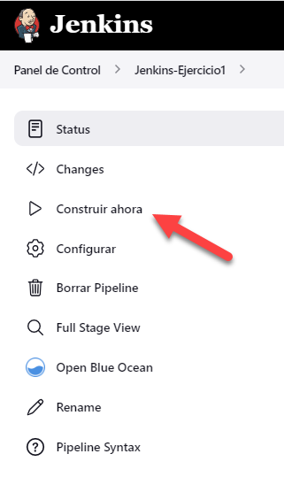

# Ejercicio 1 Jenkins

## CI/CD de una Java + Gradle

El directorio base de este ejercicio sera `4-cd/Jenkins/Ejercicio1/`

Accedo al Jenkins que tengo en mi local (<http://localhost:8080/>)
En el menu izquierdo creo una nueva tarea.
    - Nombre "Jenkins-Ejercicio1"
    - Selecciono "Pipeline"

En la pantalla

- Descripcion "Ejercicio 1 Jenkins"
- En pipeline selecciono "Pipeline script from SCM"


Creo el fichero `Jenkinsfile` donde implementare un pipeline declarativa.

```
pipeline {
  agent any
  stages {
    ....
  }
}
```
 Creo la pipeline, donde indico el agente a utilizar y la seccion donde definiré los stages.

He de implementar los siguientes stages:

- **Checkout** descarga de código desde un repositorio remoto

    Este paso va implicito ya que al configurar la pipeline al definir la URL del repositorio GIT automaticamente lo descarga.

- **Compile** compilar el código fuente con `gradlew compileJava`

    Primero con `dir` me situo en el directorio. Luego ejecuto el comando de compilar.

  ``` code
  stage('Compile') {
    steps {
      dir('./4-cd/Jenkins/Ejercicio1/calculator') {
        sh '''
          ./gradlew compileJava
        '''
      }
    }
  }
  ```

  Como gradlew es un comando que se descarga del repo, le tendré que asignar permisos de ejecución antes de llamarlo.
  Podria asignarla en el mismo, pero creo un stage previo por si necesito hacer mas acciones previas como por ejemplo mostrar la version de java.

  ``` code
  stage('Preparation') {
    steps {
      dir('./4-cd/Jenkins/Ejercicio1/calculator') {
        sh '''
          java -version
          chmod +x gradlew
        '''
      }
    }
  }
  ```

- **Unit Tests** ejecutar los test unitarios, para ello utilizar `gradlew test`

  Es como el de compilar pero cambiando el comando.

  ``` code
  stage('Unit Test') {
    steps {
      dir('./4-cd/Jenkins/Ejercicio1/calculator') {
        sh '''
            ./gradlew test
        '''
      }
    }
  }
  ```

Fichero Jenkins completo

``` code
pipeline {
  agent any
  stages {
    stage('Preparation') {
      steps {
        dir('./4-cd/Jenkins/Ejercicio1/calculator') {
          sh '''
            java -version
            chmod +x gradlew
          '''
        }
      }
    }
    stage('Compile') {
      steps {
        dir('./4-cd/Jenkins/Ejercicio1/calculator') {
          sh '''
              ./gradlew compileJava
          '''
        }
      }
    }
    stage('Unit Test') {
      steps {
        dir('./4-cd/Jenkins/Ejercicio1/calculator') {
          sh '''
              ./gradlew test
          '''
        }
      }
    }
  }
}
```

Una vez subido el fichero al repo ejecuto la pipeline



Consola de salida

``` bash
Started by user Josep Maria Tuset
Obtained 4-cd/Jenkins/Ejercicio1/Jenkinsfile from git https://github.com/josepmariatuset/entregas-bootcamp-devops.git
[Pipeline] Start of Pipeline
[Pipeline] node
Running on Jenkins in /var/jenkins_home/workspace/Jenkins-Ejercicio1
[Pipeline] {
[Pipeline] stage
[Pipeline] { (Declarative: Checkout SCM)
[Pipeline] checkout
Selected Git installation does not exist. Using Default
The recommended git tool is: NONE
No credentials specified
 > git rev-parse --resolve-git-dir /var/jenkins_home/workspace/Jenkins-Ejercicio1/.git # timeout=10
Fetching changes from the remote Git repository
 > git config remote.origin.url https://github.com/josepmariatuset/entregas-bootcamp-devops.git # timeout=10
Fetching upstream changes from https://github.com/josepmariatuset/entregas-bootcamp-devops.git
 > git --version # timeout=10
 > git --version # 'git version 2.30.2'
 > git fetch --tags --force --progress -- https://github.com/josepmariatuset/entregas-bootcamp-devops.git +refs/heads/*:refs/remotes/origin/* # timeout=10
 > git rev-parse refs/remotes/origin/04-cd^{commit} # timeout=10
Checking out Revision 27cf86085679b4766440ff48945d854b228fe23e (refs/remotes/origin/04-cd)
 > git config core.sparsecheckout # timeout=10
 > git checkout -f 27cf86085679b4766440ff48945d854b228fe23e # timeout=10
Commit message: "update readme"
 > git rev-list --no-walk 27cf86085679b4766440ff48945d854b228fe23e # timeout=10
[Pipeline] }
[Pipeline] // stage
[Pipeline] withEnv
[Pipeline] {
[Pipeline] stage
[Pipeline] { (Preparation)
[Pipeline] dir
Running in /var/jenkins_home/workspace/Jenkins-Ejercicio1/4-cd/Jenkins/Ejercicio1/calculator
[Pipeline] {
[Pipeline] sh
+ java -version
openjdk version "11.0.16.1" 2022-08-12
OpenJDK Runtime Environment Temurin-11.0.16.1+1 (build 11.0.16.1+1)
OpenJDK 64-Bit Server VM Temurin-11.0.16.1+1 (build 11.0.16.1+1, mixed mode)
+ chmod +x gradlew
[Pipeline] }
[Pipeline] // dir
[Pipeline] }
[Pipeline] // stage
[Pipeline] stage
[Pipeline] { (Compile)
[Pipeline] dir
Running in /var/jenkins_home/workspace/Jenkins-Ejercicio1/4-cd/Jenkins/Ejercicio1/calculator
[Pipeline] {
[Pipeline] sh
+ ./gradlew compileJava
Starting a Gradle Daemon (subsequent builds will be faster)
> Task :compileJava UP-TO-DATE

BUILD SUCCESSFUL in 5s
1 actionable task: 1 up-to-date
[Pipeline] }
[Pipeline] // dir
[Pipeline] }
[Pipeline] // stage
[Pipeline] stage
[Pipeline] { (Unit Test)
[Pipeline] dir
Running in /var/jenkins_home/workspace/Jenkins-Ejercicio1/4-cd/Jenkins/Ejercicio1/calculator
[Pipeline] {
[Pipeline] sh
+ ./gradlew test
> Task :compileJava UP-TO-DATE
> Task :processResources UP-TO-DATE
> Task :classes UP-TO-DATE
> Task :compileTestJava UP-TO-DATE
> Task :processTestResources NO-SOURCE
> Task :testClasses UP-TO-DATE
> Task :test UP-TO-DATE

BUILD SUCCESSFUL in 1s
4 actionable tasks: 4 up-to-date
[Pipeline] }
[Pipeline] // dir
[Pipeline] }
[Pipeline] // stage
[Pipeline] }
[Pipeline] // withEnv
[Pipeline] }
[Pipeline] // node
[Pipeline] End of Pipeline
Finished: SUCCESS

```