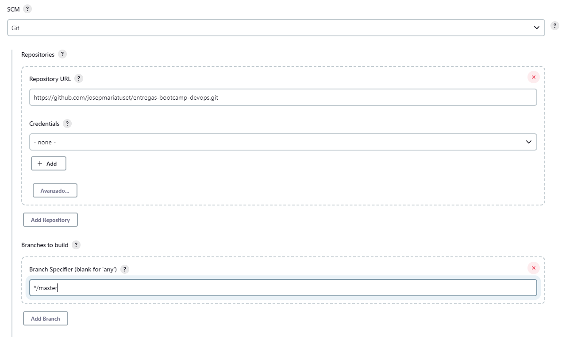
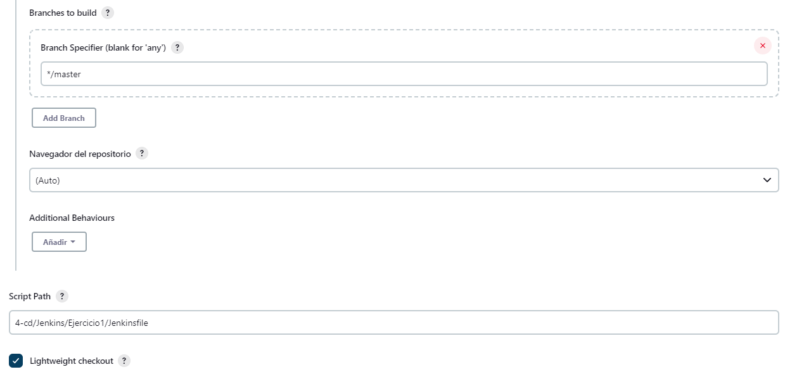

# Ejercicio 1 Jenkins

## CI/CD de una Java + Gradle

El directorio base de este ejercicio sera `4-cd/Jenkins/Ejercicio1/`

Accedo al Jenkins que tengo en mi local (<http://localhost:8080/>)
En el menu izquierdo creo una nueva tarea.
    - Nombre "Jenkins-Ejercicio1"
    - Selecciono "Pipeline"

En la pantalla

- Descripcion "Ejercicio 1 Jenkins"
- En pipeline selecciono "Pipeline script from SCM"



Creo el fichero `Jenkinsfile` donde implementare un pipeline declarativa.

```
pipeline {
  agent any
  stages {
    ....
  }
}
```
 Creo la pipeline, donde indico el agente a utilizar y la seccion donde definiré los stages.

He de implementar los siguientes stages:

- **Checkout** descarga de código desde un repositorio remoto

    Este paso va implicito ya que al configurar la pipeline al definir la URL del repositorio GIT automaticamente lo descarga.

- **Compile** compilar el código fuente con `gradlew compileJava`

    Primero con `dir` me situo en el directorio. Luego ejecuto el comando de compilar.

  ``` code
  stage('Compile') {
    steps {
      dir('./4-cd/Jenkins/Ejercicio1/calculator') {
        sh '''
          ./gradlew compileJava
        '''
      }
    }
  }
  ```

  Como gradlew es un comando que se descarga del repo, le tendré que asignar permisos de ejecución antes de llamarlo. 
  Podria asignarla en el mismo, pero creo un stage previo por si necesito hacer mas acciones previas. 

  ``` code
  stage('Preparation') {
    steps {
      dir('./4-cd/Jenkins/Ejercicio1/calculator') {
        sh '''
          chmod +x gradlew
        '''
      }
    }
  }
  ```

- **Unit Tests** ejecutar los test unitarios, para ello utilizar gradlew test


El primer stage va implicito ya que se descarga el repositorio para poder acceder a la pipeline.


```
pipeline {
  agent any
  stages {
    stage('Preparation') {
      steps {
        dir('./4-cd/Jenkins/Ejercicio1/calculator') {
          sh '''
              chmod +x gradlew
          '''
        }
      }
    }
    stage('Compile') {
      steps {
        dir('./4-cd/Jenkins/Ejercicio1/calculator') {
          sh '''
              ./gradlew compileJava
          '''
        }
      }
    }
    stage('Unit Test') {
      steps {
        dir('./4-cd/Jenkins/Ejercicio1/calculator') {
          sh '''
              ./gradlew test
          '''
        }
      }
    }
  }
}
```