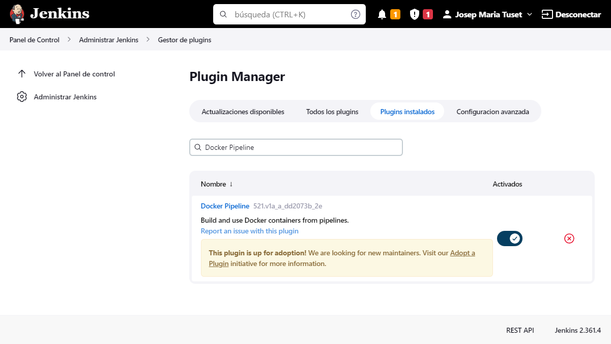

# Ejercicio 2 Jenkins

## Modificar la pipeline para que utilice la imagen Docker de Gradle como build runner

Verifico que tengo el pluguin de Docker Pipeline en jenkins.
En jenkins:

- Ir a `Panel de control`
- En el menu ir a `Administrar Jenkins`
- En `System Configuration` ir a `Administrar plugins`.
- Seleccionar `Plugins instalados`
- En la caja de busqueda escribir `Docker Pipeline`
- Verificar que aparece el pluguin y esta activo



En el fichero `Jenkinsfile` configuro el agente docker.

```
  agent {
    docker { image 'gradle:6.6.1-jre14-openj9' }
  }
```

Ejecuto la pipeline

Salida consola
```bash
Started by user Josep Maria Tuset
Obtained 4-cd/Jenkins/Ejercicio2/Jenkinsfile from git https://github.com/josepmariatuset/entregas-bootcamp-devops.git
[Pipeline] Start of Pipeline
[Pipeline] node
Running on Jenkins in /var/jenkins_home/workspace/Jenkins-Ejercicio2
[Pipeline] {
[Pipeline] stage
[Pipeline] { (Declarative: Checkout SCM)
[Pipeline] checkout
Selected Git installation does not exist. Using Default
The recommended git tool is: NONE
No credentials specified
Cloning the remote Git repository
Cloning repository https://github.com/josepmariatuset/entregas-bootcamp-devops.git
 > git init /var/jenkins_home/workspace/Jenkins-Ejercicio2 # timeout=10
Fetching upstream changes from https://github.com/josepmariatuset/entregas-bootcamp-devops.git
 > git --version # timeout=10
 > git --version # 'git version 2.30.2'
 > git fetch --tags --force --progress -- https://github.com/josepmariatuset/entregas-bootcamp-devops.git +refs/heads/*:refs/remotes/origin/* # timeout=10
 > git config remote.origin.url https://github.com/josepmariatuset/entregas-bootcamp-devops.git # timeout=10
 > git config --add remote.origin.fetch +refs/heads/*:refs/remotes/origin/* # timeout=10
Avoid second fetch
 > git rev-parse refs/remotes/origin/04-cd^{commit} # timeout=10
Checking out Revision 4cb915a70126c284db631335ee4e468412b9f9b9 (refs/remotes/origin/04-cd)
 > git config core.sparsecheckout # timeout=10
 > git checkout -f 4cb915a70126c284db631335ee4e468412b9f9b9 # timeout=10
Commit message: "Add jenkins 2"
First time build. Skipping changelog.
[Pipeline] }
[Pipeline] // stage
[Pipeline] withEnv
[Pipeline] {
[Pipeline] isUnix
[Pipeline] withEnv
[Pipeline] {
[Pipeline] sh
+ docker inspect -f . gradle:6.6.1-jre14-openj9

Error: No such object: gradle:6.6.1-jre14-openj9
[Pipeline] isUnix
[Pipeline] withEnv
[Pipeline] {
[Pipeline] sh
+ docker pull gradle:6.6.1-jre14-openj9
6.6.1-jre14-openj9: Pulling from library/gradle
171857c49d0f: Pulling fs layer
419640447d26: Pulling fs layer
61e52f862619: Pulling fs layer
dd4d4e9526b1: Pulling fs layer
bf3d390cead9: Pulling fs layer
4d606aeb4725: Pulling fs layer
9d0088d94767: Pulling fs layer
97107a361991: Pulling fs layer
dd4d4e9526b1: Waiting
bf3d390cead9: Waiting
97107a361991: Waiting
4d606aeb4725: Waiting
419640447d26: Verifying Checksum
419640447d26: Download complete
61e52f862619: Verifying Checksum
61e52f862619: Download complete
dd4d4e9526b1: Verifying Checksum
dd4d4e9526b1: Download complete
4d606aeb4725: Verifying Checksum
4d606aeb4725: Download complete
171857c49d0f: Download complete
171857c49d0f: Pull complete
419640447d26: Pull complete
61e52f862619: Pull complete
dd4d4e9526b1: Pull complete
bf3d390cead9: Verifying Checksum
bf3d390cead9: Download complete
bf3d390cead9: Pull complete
4d606aeb4725: Pull complete
9d0088d94767: Verifying Checksum
9d0088d94767: Download complete
9d0088d94767: Pull complete
97107a361991: Verifying Checksum
97107a361991: Download complete
97107a361991: Pull complete
Digest: sha256:53e66d3453fd3a808b74ceb6f7f545e0eec863176dcaaac977720af457e8cc90
Status: Downloaded newer image for gradle:6.6.1-jre14-openj9
docker.io/library/gradle:6.6.1-jre14-openj9
[Pipeline] }
[Pipeline] // withEnv
[Pipeline] }
[Pipeline] // withEnv
[Pipeline] withDockerContainer
Jenkins seems to be running inside container 975b6a3bd77971bc8bbae17b1585d89c521c01b619f02ac12ebfdbff32286a20
but /var/jenkins_home/workspace/Jenkins-Ejercicio2 could not be found among []
but /var/jenkins_home/workspace/Jenkins-Ejercicio2@tmp could not be found among []
$ docker run -t -d -u 1000:1000 -w /var/jenkins_home/workspace/Jenkins-Ejercicio2 -v /var/jenkins_home/workspace/Jenkins-Ejercicio2:/var/jenkins_home/workspace/Jenkins-Ejercicio2:rw,z -v /var/jenkins_home/workspace/Jenkins-Ejercicio2@tmp:/var/jenkins_home/workspace/Jenkins-Ejercicio2@tmp:rw,z -e ******** -e ******** -e ******** -e ******** -e ******** -e ******** -e ******** -e ******** -e ******** -e ******** -e ******** -e ******** -e ******** -e ******** -e ******** -e ******** -e ******** -e ******** -e ******** -e ******** -e ******** -e ******** -e ******** -e ******** -e ******** -e ******** -e ******** -e ******** -e ******** gradle:6.6.1-jre14-openj9 cat
$ docker top 817c6a85d6aefcc9875443e6e637610dc790eae5c4a5e4fc84c41bb6e24bfcdf -eo pid,comm
[Pipeline] {
[Pipeline] stage
[Pipeline] { (Preparation)
[Pipeline] dir
Running in /var/jenkins_home/workspace/Jenkins-Ejercicio2/4-cd/Jenkins/Ejercicio1/calculator
[Pipeline] {
[Pipeline] sh
+ chmod +x gradlew
[Pipeline] }
[Pipeline] // dir
[Pipeline] }
[Pipeline] // stage
[Pipeline] stage
[Pipeline] { (Compile)
[Pipeline] dir
Running in /var/jenkins_home/workspace/Jenkins-Ejercicio2/4-cd/Jenkins/Ejercicio1/calculator
[Pipeline] {
[Pipeline] sh
+ ./gradlew compileJava
Downloading https://services.gradle.org/distributions/gradle-6.6.1-bin.zip
.........10%..........20%..........30%..........40%.........50%..........60%..........70%..........80%..........90%.........100%

Welcome to Gradle 6.6.1!

Here are the highlights of this release:
 - Experimental build configuration caching
 - Built-in conventions for handling credentials
 - Java compilation supports --release flag

For more details see https://docs.gradle.org/6.6.1/release-notes.html

Starting a Gradle Daemon (subsequent builds will be faster)
> Task :compileJava

BUILD SUCCESSFUL in 29s
1 actionable task: 1 executed
[Pipeline] }
[Pipeline] // dir
[Pipeline] }
[Pipeline] // stage
[Pipeline] stage
[Pipeline] { (Unit Test)
[Pipeline] dir
Running in /var/jenkins_home/workspace/Jenkins-Ejercicio2/4-cd/Jenkins/Ejercicio1/calculator
[Pipeline] {
[Pipeline] sh
+ ./gradlew test
> Task :compileJava UP-TO-DATE
> Task :processResources
> Task :classes
> Task :compileTestJava
> Task :processTestResources NO-SOURCE
> Task :testClasses
> Task :test

BUILD SUCCESSFUL in 7s
4 actionable tasks: 3 executed, 1 up-to-date
[Pipeline] }
[Pipeline] // dir
[Pipeline] }
[Pipeline] // stage
[Pipeline] }
$ docker stop --time=1 817c6a85d6aefcc9875443e6e637610dc790eae5c4a5e4fc84c41bb6e24bfcdf
$ docker rm -f 817c6a85d6aefcc9875443e6e637610dc790eae5c4a5e4fc84c41bb6e24bfcdf
[Pipeline] // withDockerContainer
[Pipeline] }
[Pipeline] // withEnv
[Pipeline] }
[Pipeline] // node
[Pipeline] End of Pipeline
Finished: SUCCESS
```