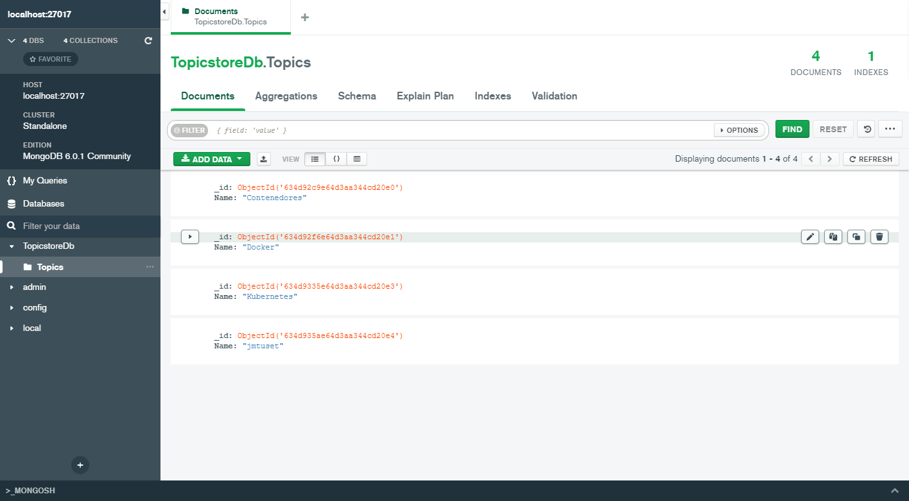
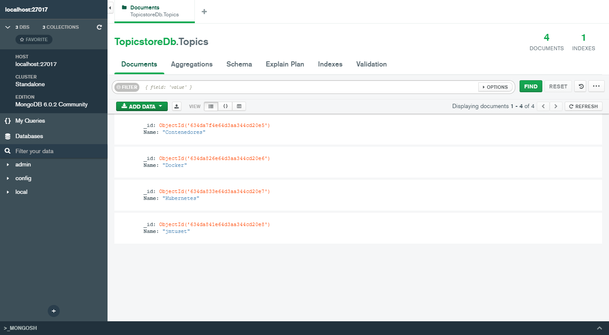
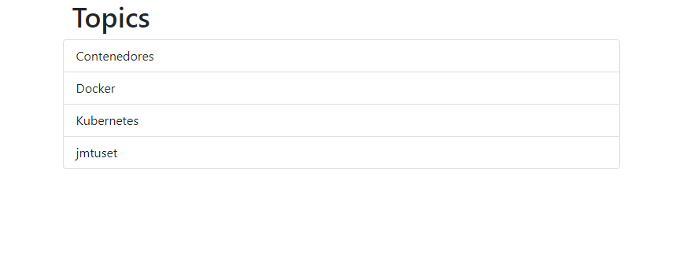

#Pasos
- Crear una red llamada lemoncode-challenge
```
docker network create lemoncode-challenge
```
- Crear contenedor de mongo con el nombre 'some-mongo', que utilice el puerto 27017, con un volumen para los datos mapeado a la ruta /data/db
```
docker run -d --name some-mongo -p 27017:27017 --network lemoncode-challenge -v mongodbdata:/dbdata mongo
```
- Con el <b>MongoDB Compass</b> me conecto al mongo localhost:27017 sin autenticación. Creo la base de datos <b>TopicstoreDb</b> y la colección <b>Topics</b>



- Compilar el backend. Desde el directorio backend
```
dotnet build .\backend.csproj
```
OUTPUT
```
Microsoft (R) Build Engine versión 17.0.0+c9eb9dd64 para .NET
Copyright (C) Microsoft Corporation. Todos los derechos reservados.

  Determinando los proyectos que se van a restaurar...
  Se ha restaurado C:\Repos\bootcamp-devops-lemoncode\01-contenedores\lemoncode-challenge\backend\backend.csproj (en 7.28 sec).
  backend -> C:\Repos\bootcamp-devops-lemoncode\01-contenedores\lemoncode-challenge\backend\bin\Debug\netcoreapp3.1\backend.dll

Compilación correcta.
    0 Advertencia(s)
    0 Errores

Tiempo transcurrido 00:00:19.62
```

- Ejecuto la aplicación de backend

```
dotnet run .\backend.csproj  
```
OUTPUT
```
info: Microsoft.Hosting.Lifetime[0]
      Now listening on: http://localhost:5000
info: Microsoft.Hosting.Lifetime[0]
      Application started. Press Ctrl+C to shut down.
info: Microsoft.Hosting.Lifetime[0]
      Hosting environment: Development
info: Microsoft.Hosting.Lifetime[0]
      Content root path: C:\Repos\bootcamp-devops-lemoncode\01-contenedores\lemoncode-challenge\backend

```
- Verifico que la API de backend funciona. En el navegador cargo la URL http://localhost:5000/api/topics. 
```
[{"id":"634d92c9e64d3aa344cd20e0","topicName":"Contenedores"},{"id":"634d92f6e64d3aa344cd20e1","topicName":"Docker"},{"id":"634d9335e64d3aa344cd20e3","topicName":"Kubernetes"},{"id":"634d935ae64d3aa344cd20e4","topicName":"jmtuset"}]
```

- Dockerizo app backend. Dentro de backend creo el fichero Dockerfile.
```
# Stage 1
FROM mcr.microsoft.com/dotnet/core/sdk:3.1 AS build
WORKDIR /build
COPY . .
RUN dotnet restore
RUN dotnet publish -c Release -o /app
# Stage 2
FROM mcr.microsoft.com/dotnet/core/aspnet:3.1 AS final
WORKDIR /app
COPY --from=build /app .
ENTRYPOINT ["dotnet", "Core3Api.dll"]
```

- Fuera de la carpeta backend, en la raiz, creo el fichero docker-compose.yml
```
version: '3.4'

services:
  mongo:
    image: mongo
    container_name: some-mongo
    volumes:
      - mongodbdata:/data/db
    restart: always
    networks: 
        - lemoncode-challenge
    ports:
      - 27017:27017   #temporalmente expongo el mongo

  backend:
    image: backend
    container_name: backend
    build:
      context: ./backend
      dockerfile: ./Dockerfile
    networks: 
        - lemoncode-challenge
    ports:
      - 5000:5000
volumes:
    mongodbdata:

networks:
    lemoncode-challenge: 

```
- Actualizo la cadena de conexion base de datos en el fichero appsettings.json. Cambio localhost por some-mongo
```
{
  "TopicstoreDatabaseSettings": {
    "ConnectionString": "mongodb://some-mongo:27017",
    "TopicsCollectionName": "Topics",
    "DatabaseName": "TopicstoreDb"
  },
  "Logging": {
    "LogLevel": {
      "Default": "Information",
      "Microsoft": "Warning",
      "Microsoft.Hosting.Lifetime": "Information"
    }
  },
  "AllowedHosts": "*"
}
```

- Contruyo el backend
```
docker-compose build
```
OUTPUT
```
[+] Building 0.5s (19/19) FINISHED
 => [internal] load build definition from Dockerfile                                                                                         0.0s 
 => => transferring dockerfile: 32B                                                                                                          0.0s 
 => [internal] load .dockerignore                                                                                                            0.0s 
 => => transferring context: 35B                                                                                                             0.0s 
 => [internal] load metadata for mcr.microsoft.com/dotnet/sdk:3.1-focal                                                                      0.4s 
 => [internal] load metadata for mcr.microsoft.com/dotnet/aspnet:3.1-focal                                                                   0.4s 
 => [internal] load build context                                                                                                            0.0s 
 => => transferring context: 560B                                                                                                            0.0s 
 => [build 1/7] FROM mcr.microsoft.com/dotnet/sdk:3.1-focal@sha256:d547bffb668519a3d226f8e3b56fadf9db80c18aa9be604f64dec712c0b96b1f          0.0s 
 => [base 1/3] FROM mcr.microsoft.com/dotnet/aspnet:3.1-focal@sha256:824a7f9f28eb3b951abdaaa0b0cbabc1e3f14e5d622741ec2ee8e5e0b8fd6232        0.0s 
 => CACHED [base 2/3] WORKDIR /app                                                                                                           0.0s 
 => CACHED [base 3/3] RUN adduser -u 5678 --disabled-password --gecos "" appuser && chown -R appuser /app                                    0.0s 
 => CACHED [final 1/2] WORKDIR /app                                                                                                          0.0s 
 => CACHED [build 2/7] WORKDIR /src                                                                                                          0.0s 
 => CACHED [build 3/7] COPY [backend.csproj, ./]                                                                                             0.0s 
 => CACHED [build 4/7] RUN dotnet restore "backend.csproj"                                                                                   0.0s 
 => CACHED [build 5/7] COPY . .                                                                                                              0.0s 
 => CACHED [build 6/7] WORKDIR /src/.                                                                                                        0.0s 
 => CACHED [build 7/7] RUN dotnet build "backend.csproj" -c Release -o /app/build                                                            0.0s 
 => CACHED [publish 1/1] RUN dotnet publish "backend.csproj" -c Release -o /app/publish /p:UseAppHost=false                                  0.0s 
 => CACHED [final 2/2] COPY --from=publish /app/publish .                                                                                    0.0s 
 => exporting to image                                                                                                                       0.0s 
 => => exporting layers                                                                                                                      0.0s 
 => => writing image sha256:198e6bc805e1dad81347a15bee00b979cec7b32192586d903eafff0954a14be9                                                 0.0s 
 => => naming to docker.io/library/backend  
```
- Ejecuto el contenedor
```
docker-compose up
```
OUTPUT
```
[+] Running 1/0
 - Container lemoncode-challenge-backend-1  Created                                                                                            0.0s
Attaching to lemoncode-challenge-backend-1
lemoncode-challenge-backend-1  | info: Microsoft.Hosting.Lifetime[0]
lemoncode-challenge-backend-1  |       Now listening on: http://[::]:5000
lemoncode-challenge-backend-1  | info: Microsoft.Hosting.Lifetime[0]
lemoncode-challenge-backend-1  |       Application started. Press Ctrl+C to shut down.
lemoncode-challenge-backend-1  | info: Microsoft.Hosting.Lifetime[0]
lemoncode-challenge-backend-1  |       Hosting environment: Production
lemoncode-challenge-backend-1  | info: Microsoft.Hosting.Lifetime[0]
lemoncode-challenge-backend-1  |       Content root path: /app
```

- Al crear el volumen desde el docker-compose le pone un prefijo y crea uno de nuevo. Repito los pasos de crear la base de datos con el <b>MongoDB Compass</b> me conecto al mongo localhost:27017 sin autenticación.


- Verifico el backend. Abro en el navegador la url http://localhost:5000/api/topics
```
[{"id":"634da7f4e64d3aa344cd20e5","topicName":"Contenedores"},{"id":"634da826e64d3aa344cd20e6","topicName":"Docker"},{"id":"634da833e64d3aa344cd20e7","topicName":"Kubernetes"},{"id":"634da841e64d3aa344cd20e8","topicName":"jmtuset"}]
```

- Compilo frontend.  Desde el directorio frontend
```
npm install
``` 

OUTPUT
```
added 69 packages, and audited 70 packages in 3s

2 packages are looking for funding
  run `npm fund` for details

2 vulnerabilities (1 high, 1 critical)

To address all issues, run:
  npm audit fix

Run `npm audit` for details.
npm notice
npm notice New minor version of npm available! 8.1.0 -> 8.19.2
npm notice Changelog: https://github.com/npm/cli/releases/tag/v8.19.2
npm notice Run npm install -g npm@8.19.2 to update!
npm notice
```
- Lanzamos frontend. Ejecutar el comando
```
npm start
```

OUTPUT
```

> frontend@1.0.0 start
> node server.js

Server running on port 3000 with http://localhost:5000/api/topics
```
- Verifico frontend. Abro en el navagedor http://localhost:3000/
.

- Dockerizo app frontend. Dentro de frontend creo el fichero Dockerfile.
```
FROM node:lts-alpine
ENV NODE_ENV=production
WORKDIR /usr/src/app
COPY ["package.json", "package-lock.json*", "npm-shrinkwrap.json*", "./"]
RUN npm install --production --silent && mv node_modules ../
COPY . .
EXPOSE 3000
RUN chown -R node /usr/src/app
USER node
CMD ["node", "server.js"]
```

- Actualizo la cadena de connecxion del backend. En el fichero server.js subtituir el localhost por backend.
```
//Módulos
const fetch = (...args) => import('node-fetch').then(({default: fetch}) => fetch(...args));
const express = require('express'),
    app = express();

const LOCAL = 'http://backend:5000/api/topics';

app.set('view engine', 'ejs');

app.get('/', async (req, res) => {

    //Recuperar topics de la API
    const response = await fetch(process.env.API_URI || LOCAL);
    const topics = await response.json();

    res.render('index', { topics });

});

app.listen(3000, () => {
    console.log(`Server running on port 3000 with ${process.env.API_URI || LOCAL}`);
});
```

- en el docker-compose de la raiz añado el servicio del frontend
```
version: '3.4'

services:
  mongo:
    image: mongo
    container_name: some-mongo
    volumes:
      - mongodbdata:/data/db
    restart: always
    networks: 
      - lemoncode-challenge
    #ports:
    #  - 27017:27017   #temporalmente expongo el mongo

  backend:
    image: backend
    container_name: backend
    build:
      context: backend
      dockerfile: ./Dockerfile
    networks: 
      - lemoncode-challenge
    #ports:
    #  - 5000:5000 #temporal expongo el backend

  frontend:
    image: frontend
    build:
      context: frontend
      dockerfile: ./Dockerfile
    environment:
      NODE_ENV: production
      API_URI: http://backend:5000/api/topics
    networks: 
      - lemoncode-challenge
    ports:
      - 8080:3000

volumes:
    mongodbdata:

networks:
    lemoncode-challenge: 

```

- contruyo la solucion.
```
docker-compose build
```
OUTPUT
```
[+] Building 2.5s (29/29) FINISHED
 => [frontend internal] load build definition from Dockerfile                                                                     0.0s 
 => => transferring dockerfile: 32B                                                                                               0.0s 
 => [backend internal] load build definition from Dockerfile                                                                      0.0s 
 => => transferring dockerfile: 32B                                                                                               0.0s 
 => [frontend internal] load .dockerignore                                                                                        0.0s 
 => => transferring context: 35B                                                                                                  0.0s 
 => [backend internal] load .dockerignore                                                                                         0.0s 
 => => transferring context: 35B                                                                                                  0.0s 
 => [frontend internal] load metadata for docker.io/library/node:lts-alpine                                                       2.2s 
 => [backend internal] load metadata for mcr.microsoft.com/dotnet/sdk:3.1-focal                                                   0.5s 
 => [backend internal] load metadata for mcr.microsoft.com/dotnet/aspnet:3.1-focal                                                0.4s 
 => [backend internal] load build context                                                                                         0.0s 
 => => transferring context: 560B                                                                                                 0.0s 
 => [backend base 1/3] FROM mcr.microsoft.com/dotnet/aspnet:3.1-focal@sha256:824a7f9f28eb3b951abdaaa0b0cbabc1e3f14e5d622741ec2ee  0.0s 
 => [backend build 1/7] FROM mcr.microsoft.com/dotnet/sdk:3.1-focal@sha256:d547bffb668519a3d226f8e3b56fadf9db80c18aa9be604f64dec  0.0s 
 => CACHED [backend base 2/3] WORKDIR /app                                                                                        0.0s 
 => CACHED [backend base 3/3] RUN adduser -u 5678 --disabled-password --gecos "" appuser && chown -R appuser /app                 0.0s 
 => CACHED [backend final 1/2] WORKDIR /app                                                                                       0.0s 
 => CACHED [backend build 2/7] WORKDIR /src                                                                                       0.0s 
 => CACHED [backend build 3/7] COPY [backend.csproj, ./]                                                                          0.0s 
 => CACHED [backend build 4/7] RUN dotnet restore "backend.csproj"                                                                0.0s 
 => CACHED [backend build 5/7] COPY . .                                                                                           0.0s 
 => CACHED [backend build 6/7] WORKDIR /src/.                                                                                     0.0s 
 => CACHED [backend build 7/7] RUN dotnet build "backend.csproj" -c Release -o /app/build                                         0.0s 
 => CACHED [backend publish 1/1] RUN dotnet publish "backend.csproj" -c Release -o /app/publish /p:UseAppHost=false               0.0s 
 => CACHED [backend final 2/2] COPY --from=publish /app/publish .                                                                 0.0s 
 => [frontend] exporting to image                                                                                                 0.0s 
 => => exporting layers                                                                                                           0.0s 
 => => writing image sha256:198e6bc805e1dad81347a15bee00b979cec7b32192586d903eafff0954a14be9                                      0.0s 
 => => naming to docker.io/library/backend                                                                                        0.0s 
 => => writing image sha256:8f7e377064cd55f2fee6023445d91890058ccf408b3df4008bb5b8ac3a7d46d7                                      0.0s 
 => => naming to docker.io/library/frontend                                                                                       0.0s 
 => [frontend 1/6] FROM docker.io/library/node:lts-alpine@sha256:2175727cef5cad4020cb77c8c101d56ed41d44fbe9b1157c54f820e3d345eab  0.0s 
 => [frontend internal] load build context                                                                                        0.0s 
 => => transferring context: 161B                                                                                                 0.0s 
 => CACHED [frontend 2/6] WORKDIR /usr/src/app                                                                                    0.0s 
 => CACHED [frontend 3/6] COPY [package.json, package-lock.json*, npm-shrinkwrap.json*, ./]                                       0.0s 
 => CACHED [frontend 4/6] RUN npm install --production --silent && mv node_modules ../                                            0.0s 
 => CACHED [frontend 5/6] COPY . .                                                                                                0.0s 
 => CACHED [frontend 6/6] RUN chown -R node /usr/src/app    
```

- Ejecuto el stack desatachado
```
docker-compose up -d
```
OUTPUT
```
[+] Running 3/3
 - Container backend                         Started                                                                              0.5s
 - Container some-mongo                      Started                                                                              0.9s
 - Container lemoncode-challenge-frontend-1  Started                                                                              0.9s
```

- Verifico que funciona. Abro en el navegador http://localhost:8080